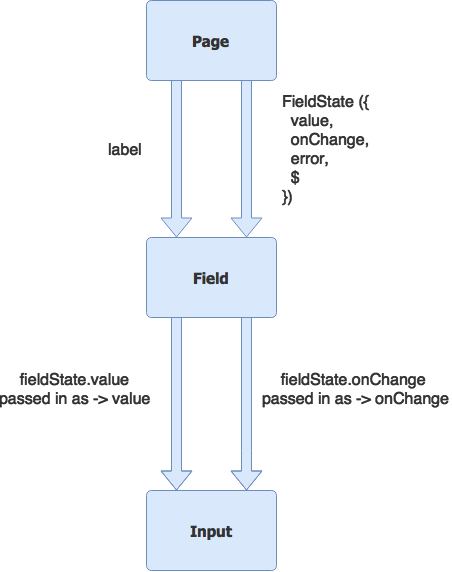

> Form state so simple that you will fall in love ❤️

<iframe src="https://ghbtns.com/github-btn.html?user=formstate&repo=formstate&type=star&count=true" frameborder="0" scrolling="0" width="170px" height="20px"></iframe>

> [Powered by your github ⭐s](https://github.com/formstate/formstate/stargazers).

Note that the API is quite simple and consists of `Validator`, `FieldState` and `FormState`. It is written in TypeScript and designed for TypeSafety 🌹.


> If you are looking for comparisons, they are a covered in [why #formstate](/#/?id=why).

## Demos

If you want to see it in action [we have lots of demos here 📝](https://formstate.github.io/demos)

### Quick Example

Install:
```sh
npm install formstate --save
```

Use:
```tsx
import React from 'react';
import { observer } from 'mobx-react';
import { FormState, FieldState } from 'formstate';

class DemoState {
  // Create a field
  username = new FieldState({
    value: '',
    // Creating validators is super easy
    validators:[(val) => !val && 'username required']
  });

  // Compose fields into a form
  form = new FormState({
    username: this.username
  });

  onSubmit = async () => {
    //  Validate all fields
    const res = await this.form.validate();
    // If any errors you would know
    if (res.hasError) {
      console.log(res.error);
      return;
    }
    // Yay .. all good. Do what you want with it
    console.log(this.username.$); // Validated value!
  };
}

@observer
export class Demo extends React.Component<{},{}> {
  data = new DemoState();
  render(){
    return (
      const data = this.data;

      <form onSubmit={data.onSubmit}>
        <input
          type="text"
          value={data.username.value}
          onChange={(e)=>data.username.onChange(e.target.value)}
        />
        <p>{data.username.error}</p>
        <p>{data.form.error}</p>
      </form>
    ));
  }
}
```

We could explain the *just the API*, but to help people understand how truly simple it is we will even go ahead and explain all the rational 🌹.

> TIP: I assume you are familiar with [promises](https://basarat.gitbooks.io/typescript/content/demo/promise.html) and [async/await](https://basarat.gitbooks.io/typescript/content/demo/async-await.html).

## Mobx

This project depends upon [mobx][mobx]. Long story short, mobx allows you to write semantic JavaScript / TypeScript code and offload the UI data binding / updating for you. We encourage you to check them out if you are not familiar with [mobx][mobx].

We provide two simple *state* classes `FieldState<TValue>` and `FormState`. These are UI framework independent (e.g. do not depend on ReactJs or AngularJS etc) as that binding is taken care of by mobx. We just manage the state for a Field (`FieldState`) or any number of Fields (`FormState`). Both of these have very simple semantics and can easily be powered by any number of UI inputs. More on this later.

## Validator

We believe that validation should have simple semantics. Validation is provided by a validator. The following is the signature for a validator.

```ts
export interface Validator<TValue> {
  (value: TValue): string | Promise<string>;
}
```

Notice that a validator is *completely* independent of any framework cruft. Its a simple function that just takes a value and returns an error message or a Promise to an error message. If there is no error it should return an empty string or anything *falsy*.

Because its just a function:
* you can easily test it in nodejs.
* you can easily wrap any validation library quite easily if you need to.
* handles server validation just as easily as local one (you just return a promise).

Example validator:

```ts
const required = (val:string) => !val && 'Value required';
```

> TIP: because the validator is so simple you can use the same function even on the server if you wanted to.

## FieldState

### Concept: Page / Field / Input
To keep your mental model (and life) simple, you want finely determined *truths* about your components.

* Truth: An input should bind to a `value` and should always show the value.

If an input needs its value changed (e.g. a use key press), it should call a passed in `onChange` *to request* a change to the said `value`.

The *page* (or whatever passed in the value), is what should *change the value* and pass in the new value to the component.

A simple diagram that shows what an input should accept:


It can be made simpler by composing the `{value, onChange}` pair into a single object (lets call it `FieldState`) that we *can* pass to the input. We can even easily create a `Field` component that selects such a pair and passes the *right things* to the input so you don't need to rewrite your *inputs* to support FieldState.


That's better, note that creating your own `Field` component gives you the opportunity to style it for *your business* and add additions properties e.g. `{label:string}` that make sense for your project:


It would be great if `FieldState` had just `value` and `onChange`. However to support validation and make it a painless experience, we have the concept of a safe / validated *value* aka `$`.

* `value`: This is the value you bind to the input. It is updated as soon as `onChange` is called to keep the UI always responsive.
* `$`: This is the value *you set using code* OR is a user entered `value` that has passed validation.

The following explains usage of `$`

```ts
const res = await someField.validate();
if (res.hasError) return;
sendToServer(someField.$); // Validated and safe
```

The FieldState takes an optional list of validators so you would use it as simply as:

```ts
const required = (val:string) => !val && 'Value required';
const name = new FieldState({value:'', validators = [required]});
```

### Demo: Field
You create a `Field` component based on your design. But its actually not hard, essentially your `Field` components looks like the following:

```ts
type FieldProps = {
  id: string,
  label: string,
  fieldState: FieldState<string>,
}

@observer
export class Field extends React.Component<FieldProps, {}>{
  render() {
    const fieldState = this.props.fieldState;
    return (
      <div>
        <label htmlFor={this.props.id}>{this.props.label}<label>
        <input
          type="text"
          value={fieldState.value}
          onChange={(e)=>fieldState.onChange(e.target.value)}
        />
        <p>{fieldState.error}</p>
      </div>
    );
  }
}
```

Here is a diagram for the visual thinkers:



## FormState

`FormState` really just gives you a *composite* API over other `FieldState`s or even other `FormState`s.

To demonstrate this composibility consider the following simple example:

```ts
const required = (val:string) => !val && 'Value required';
const form = new FormState({
  display: new FieldState({value:''}),
  credentials: new FormState({
    username: new FieldState({value: '', validators:[required]}),
    password: new FieldState({value: '', validators:[required]}),
  })
})
```

### Access values
You traverse a form the same way you traverse a field, with the `$` member. A simple example to demonstrate form traversal:

```ts
form.$; // {display:FieldState, credentials:FormState}
form.$.display; // {value, onChange, $, validate, ... other FieldState stuff}
form.$.credentials.$; // {username: FieldState, password: FieldState}
form.$.credentials.$.username.$; // ''
```

Of course all this is type checked by TypeScript as well so you can't go wrong!

### Validate
You can nest as much as you want and any call to `validate` at any level propagates to ALL the children of that level e.g.

```ts
await form.validate(); // Validates *all the fields*
await form.value.display.validate(); // Validates just *display*
await form.value.credentials.validate(); // Validates *username* and *password*
```

You generally call `validate` at the root though, after an `onSubmit` to make sure everything is valid. This is shown in the first *quick example* 🌹.

> Since we call `validate` on all sub fields / forms it also automatically populates the *error* members of all the fields. So the user gets automatic nice UX against each invalid field if there is any error (assuming your Field shows its `fieldState.error`).

### Array

Sometimes you have *n* number of subforms and in that case you cannot use `{key:FormState|FieldState}` structure. This is why `FormState` also supports an array as an input.

This is demonstrated below:

```ts
const form = new FormState([
  new FormState({
    username: new FieldState({value: '', validators:[required]}),
    password: new FieldState({value: '', validators:[required]}),
  }),
  new FormState({
    username: new FieldState({value: '', validators:[required]}),
    password: new FieldState({value: '', validators:[required]}),
  }),
]);
```

Again calling `validate` will correctly validate *all* sub-children. Also any child array access is still checked by TypeScript for safety.

```ts
const res = await form.validate();
if (res.hasError) return;

/** $ is automatically inferred to be an array */
form.$[0].username.$; // The first formstate's username field's validated value

/** {username: string, password: string} */
const somethingToSendToServer = form.$.map(child =>
  ({username: child.$.username.$, password: child.$.password.$})
);
```

> TIP: It works with *n* number of subfields as well. And as always you can nest objects and arrays as needed.

## FormStateLazy
If you want to make lazy decisions about which fields to validate you can use `FormStateLazy`. This works by simply accepting a `getFields` function where you can return the fields you want to validate at that point in time.  e.g.

```
/** Some set of fields you want to maintain as a simple array */
const myFields:FieldState<string> = [];

/** Some set of fields that you optionally want to validate as a simple array */
const myFieldsOptional:FieldState<string> = [];

let someCondition: boolean = false;

// Do some stuff with your fields e.g.
myFields.push( new FieldState({value: '', validators:[required]}));

/** A lazy form state */
const form = new FormStateLazy(()=>myFields.concat(someCondition ? myFieldsOptional : []));

/** Validate just the fields that FormStateLazy will return at that time */
await form.validate();
```

## TIPS

The API is designed to be simple, but powerful enough to handle most use cases. We provide common design patterns next.

### TIP: Creating reusable components
Also as a component library author you do not need to depend on this project *or* mobx. You write it as a simple `value`, `onChange`.  Note that because of this *you can use any component library out there with this library* as every single one of those provides you with `value/onChange` 🌹.

And then the application author (which can still be just you) makes the `Field` that uses this library, *mobx* and *mobx-react* (specifically wrapping `@observer class Field extends React.Component` etc) and it all just works out.

### TIP: Sequential validation

A FieldState takes a list of validators. It basically just calls the super simple `applyValidators` function

```
function applyValidators<TValue>(value: TValue, validators: Validator<TValue>[]): Promise<string>
```

This function applies a value through a list of validators. It aborts execution and returns an error as soon as any validator returns an error.

This means that we always get well defined error messages from an validation run. Also this means you get to chain validations quite easily e.g. if you can use a pattern like to following to prevent sending bad values for server validation

```ts
validators:[required, validateFromServer]
```

### TIP: Parallel validation

You can even easily compose validators that run multiple validators in parallel if you want e.g.

```ts
validators:[(value)=>{
  return Promise.all([first(value), second(value)])
    .then(([fst,snd]) => {
      if (fst && snd) return 'Both first and second failed';
      if (fst) return 'Only first failed';
      if (snd) return 'Only second failed';
      return '';
    });
}]
```

### TIP: Empty values

We could isolate the validators from handling such cases by not calling a validator if the empty is value, but its a decision we don't want to make for *your validation requirements*. You can easily wrap your validator in a function that removes `TValue`s that you don't want to handle e.g

```ts
function ifValue(validator:Validator<TValue>):Validator<TValue>{
  return function(value: TValue) {
    if (!value || value == null) return '';
    return validator(value);
  };
}

// Usage
// validators: [ifValue(mySimplerValidator)]
```

### TIP: Customisable validators

You can easily create functions that customise a particular validation by using a *validator creating* function. e.g. a highly customisable minimum value validator:

```ts
const minValue = (minValue, message) => (val) => val < minValue && message;

// usage
validators:[minValue(1,"The minimum bid is set at $1")];
validators:[minValue(13,"Sorry, you must be 13 or older to use this website")];
```

### TIP: Cross field validation

For any cross field validation you just create a validator that uses the `FieldState` that you want to inspect. e.g. passwords must match:

```ts
const pass1 = new FieldState({ value: '', validators: [(val) => !val && 'Password required'] });
const pass2 = new FieldState({
  value: '',
  validators: [(val) => val && val !== pass1.$ && 'Passwords must match']
})
const form = new FormState({
  pass1,
  pass2
});

/** Sample user interaction */
form.$.pass1.onChange('hello');
form.$.pass2.onChange('he');

const res = await form.validate();
assert.equal(res.hasError, true);
assert.equal(pass2.error, 'Passwords must match');
```

> You don't want cycles in your fields. You can fix cycles by just having an error on the *dependent* field only.

## Why

We considered other options before creating our own. Here is our opinion:

* Type Safety: Other options are very *stringly* typed. That hampers refactor-ability, code reviews and maintainability (analysis).
* Independent of UI: This is a general purpose library that manages the form state and validity for you. Having it independent of UI allows you to *test* anything easily, review it in isolation and design fields to look exactly like you want for your application.
* Simpler Semantics: Its just functions and classes that can be written in isolation, tested in isolation, reviewed in isolation. Creating new validators is super simple. Server side validation is just as easy is simple client validations. So is creating new Fields and Forms (again strongly typed!).

[mobx]:https://github.com/mobxjs/mobx
